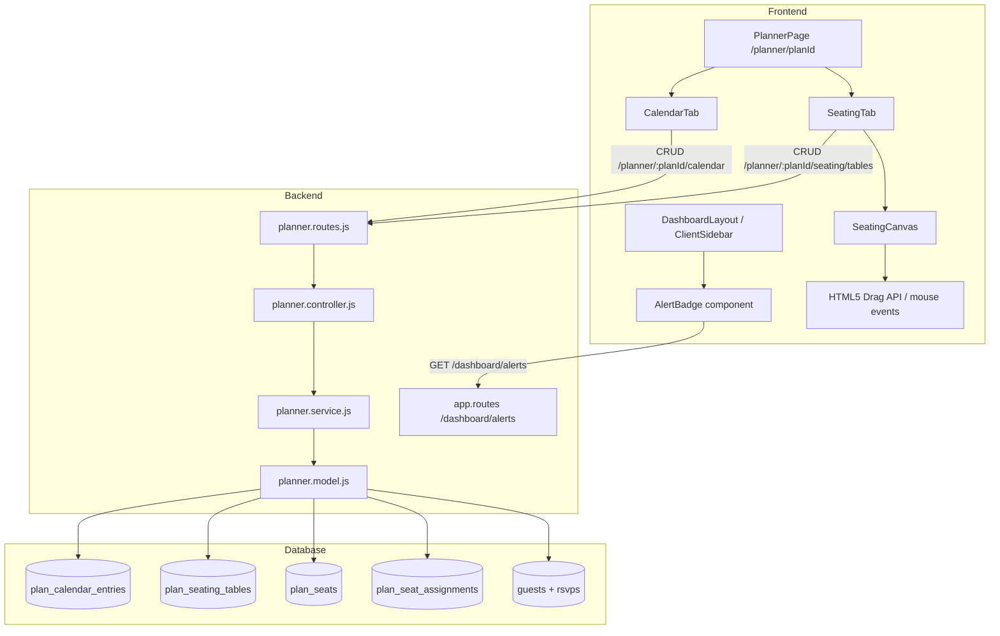

# Diseño Técnico: Planner Calendar & Seating

## Overview

Este documento describe el diseño técnico para dos nuevos módulos del planificador de eventos:

1. **Módulo de Calendario con Alertas**: Calendario mensual visual con notas y alertas por fecha, con notificación en el dashboard cuando una alerta llega a su fecha.
2. **Módulo de Mesas (Seating Chart)**: Canvas interactivo con drag & drop para organizar mesas, configurar sillas y asignar invitados a asientos con visualización de estado RSVP.

Ambos módulos se integran como nuevas pestañas en `/dashboard/planner/[planId]`, siguiendo la arquitectura existente: Node.js + Express + MySQL (backend), Next.js + Tailwind CSS (frontend), multi-tenant con autorización `use_planner`.

---

## Architecture



The alert badge is fetched client-side on every dashboard layout mount. Calendar and seating data are fetched per-tab on first activation. All mutations are optimistic-update on the frontend with backend persistence.

---

## Components and Interfaces

### Backend

#### New routes in `planner.routes.js`

```
// Calendar
GET    /planner/:planId/calendar
POST   /planner/:planId/calendar
PUT    /planner/:planId/calendar/:entryId
DELETE /planner/:planId/calendar/:entryId

// Alerts (dashboard-level, all plans of tenant)
GET    /dashboard/alerts
PUT    /dashboard/alerts/:entryId/dismiss

// Seating
GET    /planner/:planId/seating/tables
POST   /planner/:planId/seating/tables
PUT    /planner/:planId/seating/tables/:tableId
DELETE /planner/:planId/seating/tables/:tableId
POST   /planner/:planId/seating/tables/:tableId/seats/:seatId/assign
DELETE /planner/:planId/seating/tables/:tableId/seats/:seatId/assign
```

All routes use `authenticate`, `attachTenant(true)`, and `authorize('use_planner')` middleware, consistent with existing planner routes. The `/dashboard/alerts` routes are registered in `app.js` under the dashboard router (or as a separate route group), also behind `authenticate` + `attachTenant`.

#### New methods in `planner.model.js`

```js
// Calendar
getCalendarEntries(planId)
createCalendarEntry(planId, { title, type, date, description })
updateCalendarEntry(entryId, planId, fields)
deleteCalendarEntry(entryId, planId)
getActiveAlerts(tenantId)           // date <= TODAY, dismissed_at IS NULL, type = 'alert'
dismissAlert(entryId, tenantId)     // sets dismissed_at = NOW()

// Seating
getSeatingTables(planId)            // includes seats + assignments + guest name + rsvp
createSeatingTable(planId, { seat_count, is_bride_table, position_x, position_y })
updateSeatingTable(tableId, planId, fields)
deleteSeatingTable(tableId, planId)
assignSeat(seatId, tableId, planId, guestId)
unassignSeat(seatId, tableId, planId)
adjustSeats(tableId, planId, newCount)  // add/remove seats respecting assignments
getNextTableNumber(planId)          // lowest positive integer not in use
```

#### New methods in `planner.service.js`

Service layer mirrors model methods, adding:
- Tenant ownership validation for all operations (403 if planId doesn't belong to tenant)
- Duplicate bride table check (409)
- Duplicate guest assignment check (409)
- Seat count adjustment logic (preserve assigned seats)

#### New methods in `planner.controller.js`

Standard controller wrappers calling service methods, using existing `success`/`created` response helpers.

### Frontend

#### `CalendarTab` component (`frontend/src/app/dashboard/planner/[planId]/CalendarTab.jsx`)

- Renders a monthly calendar grid (7 columns, variable rows)
- Navigation: previous/next month buttons
- Dots/badges on dates that have entries
- Click on date → slide-in panel showing entries for that date + add form
- Form fields: `title` (required), `type` (nota | alerta), `description` (optional), `date` (pre-filled)
- Inline edit and delete per entry

#### `SeatingTab` component (`frontend/src/app/dashboard/planner/[planId]/SeatingTab.jsx`)

- Toolbar: "Agregar mesa", "Agregar mesa de novios" (disabled if bride table exists), summary stats
- Renders `SeatingCanvas` with all tables
- Table config panel (slide-in): seat count slider, delete button

#### `SeatingCanvas` component (inside SeatingTab)

- `<div>` with `position: relative`, fixed or scrollable dimensions
- Each table rendered as absolutely-positioned circle
- Seats rendered as smaller circles around the table (circular layout algorithm)
- Drag & drop via HTML5 Drag API (see Drag & Drop section)
- Click on empty seat → guest selector dropdown
- Click on occupied seat → shows guest name + remove button

#### `AlertBadge` component (`frontend/src/components/layout/AlertBadge.jsx`)

- Fetches `GET /dashboard/alerts` on mount
- Shows a red badge with count on the "Planificador" nav item in `ClientSidebar`
- Click → popover/panel listing active alerts with dismiss button
- Hidden when count = 0; silently suppressed on API error

---

## Data Models

### `plan_calendar_entries`

```sql
CREATE TABLE IF NOT EXISTS plan_calendar_entries (
  id           VARCHAR(36)  NOT NULL PRIMARY KEY,
  plan_id      VARCHAR(36)  NOT NULL,
  title        VARCHAR(255) NOT NULL,
  type         ENUM('nota','alerta') NOT NULL DEFAULT 'nota',
  date         DATE         NOT NULL,
  description  TEXT         NULL,
  dismissed_at DATETIME     NULL,
  created_at   DATETIME     NOT NULL DEFAULT CURRENT_TIMESTAMP,
  updated_at   DATETIME     NOT NULL DEFAULT CURRENT_TIMESTAMP ON UPDATE CURRENT_TIMESTAMP,
  INDEX idx_plan_id (plan_id),
  INDEX idx_date (date),
  INDEX idx_type_dismissed (type, dismissed_at),
  FOREIGN KEY fk_pce_plan (plan_id) REFERENCES event_plans(id) ON DELETE CASCADE
) ENGINE=InnoDB DEFAULT CHARSET=utf8mb4 COLLATE=utf8mb4_unicode_ci;
```

### `plan_seating_tables`

```sql
CREATE TABLE IF NOT EXISTS plan_seating_tables (
  id             VARCHAR(36)  NOT NULL PRIMARY KEY,
  plan_id        VARCHAR(36)  NOT NULL,
  table_number   INT          NOT NULL,
  seat_count     INT          NOT NULL DEFAULT 4,
  is_bride_table TINYINT(1)   NOT NULL DEFAULT 0,
  position_x     DECIMAL(8,2) NOT NULL DEFAULT 0,
  position_y     DECIMAL(8,2) NOT NULL DEFAULT 0,
  created_at     DATETIME     NOT NULL DEFAULT CURRENT_TIMESTAMP,
  updated_at     DATETIME     NOT NULL DEFAULT CURRENT_TIMESTAMP ON UPDATE CURRENT_TIMESTAMP,
  INDEX idx_plan_id (plan_id),
  UNIQUE KEY uq_table_number_plan (plan_id, table_number),
  FOREIGN KEY fk_pst_plan (plan_id) REFERENCES event_plans(id) ON DELETE CASCADE
) ENGINE=InnoDB DEFAULT CHARSET=utf8mb4 COLLATE=utf8mb4_unicode_ci;
```

### `plan_seats`

```sql
CREATE TABLE IF NOT EXISTS plan_seats (
  id         VARCHAR(36) NOT NULL PRIMARY KEY,
  table_id   VARCHAR(36) NOT NULL,
  seat_index INT         NOT NULL,
  created_at DATETIME    NOT NULL DEFAULT CURRENT_TIMESTAMP,
  INDEX idx_table_id (table_id),
  UNIQUE KEY uq_seat_index_table (table_id, seat_index),
  FOREIGN KEY fk_ps_table (table_id) REFERENCES plan_seating_tables(id) ON DELETE CASCADE
) ENGINE=InnoDB DEFAULT CHARSET=utf8mb4 COLLATE=utf8mb4_unicode_ci;
```

### `plan_seat_assignments`

```sql
CREATE TABLE IF NOT EXISTS plan_seat_assignments (
  id         VARCHAR(36) NOT NULL PRIMARY KEY,
  seat_id    VARCHAR(36) NOT NULL UNIQUE,
  guest_id   VARCHAR(36) NOT NULL,
  plan_id    VARCHAR(36) NOT NULL,
  created_at DATETIME    NOT NULL DEFAULT CURRENT_TIMESTAMP,
  INDEX idx_plan_id (plan_id),
  INDEX idx_guest_id (guest_id),
  FOREIGN KEY fk_psa_seat  (seat_id)  REFERENCES plan_seats(id) ON DELETE CASCADE,
  FOREIGN KEY fk_psa_guest (guest_id) REFERENCES guests(id) ON DELETE CASCADE,
  FOREIGN KEY fk_psa_plan  (plan_id)  REFERENCES event_plans(id) ON DELETE CASCADE
) ENGINE=InnoDB DEFAULT CHARSET=utf8mb4 COLLATE=utf8mb4_unicode_ci;
```

### GET /planner/:planId/seating/tables — response shape

```json
[
  {
    "id": "uuid",
    "plan_id": "uuid",
    "table_number": 1,
    "seat_count": 8,
    "is_bride_table": false,
    "position_x": 200.0,
    "position_y": 150.0,
    "seats": [
      {
        "id": "uuid",
        "seat_index": 0,
        "assignment": {
          "id": "uuid",
          "guest_id": "uuid",
          "guest_name": "Ana García",
          "rsvp_status": "confirmed"
        }
      }
    ]
  }
]
```

`rsvp_status` is derived from `rsvps.response` (confirmed/declined/maybe) or `null` if no RSVP. The frontend maps this to `Seat_Status`: `occupied` (confirmed), `pending` (maybe or pending), `free` (declined or no assignment).

---

## Drag & Drop Implementation

The seating canvas uses the **HTML5 Drag API** for table repositioning. No external library is required.

### Strategy

Each table `<div>` has `draggable="true"`. The canvas `<div>` is the drop target.

```
onDragStart(tableId, e):
  store offset = (e.clientX - table.position_x, e.clientY - table.position_y)
  e.dataTransfer.setData('tableId', tableId)

onDragOver(e):
  e.preventDefault()  // allow drop

onDrop(e):
  tableId = e.dataTransfer.getData('tableId')
  newX = e.clientX - canvasRect.left - offsetX
  newY = e.clientY - canvasRect.top  - offsetY
  clamp newX, newY to canvas bounds
  update local state immediately (optimistic)
  debounce PUT /seating/tables/:tableId { position_x: newX, position_y: newY }
```

The canvas `<div>` uses `position: relative` with a fixed pixel size (e.g. 900×600). Tables are `position: absolute` with `left: position_x` and `top: position_y`. During drag, a ghost image is shown by the browser natively.

Position is persisted to the backend on `onDrop` with a 300ms debounce to avoid flooding on rapid moves. The local state is updated immediately for a responsive feel.

---

## Seat Position Calculation Algorithm

Seats are arranged in a circle around the table center. Given `N` seats and a radius `R`:

```js
/**
 * Calculate seat positions around a table center.
 * @param {number} N - number of seats
 * @param {number} R - radius in pixels (distance from table center to seat center)
 * @param {number} cx - table center x (relative to table div, typically tableRadius)
 * @param {number} cy - table center y (relative to table div, typically tableRadius)
 * @returns {{ x: number, y: number }[]}
 */
function calcSeatPositions(N, R, cx, cy) {
  const positions = [];
  for (let i = 0; i < N; i++) {
    const angle = (2 * Math.PI * i) / N - Math.PI / 2; // start at top
    positions.push({
      x: cx + R * Math.cos(angle),
      y: cy + R * Math.sin(angle),
    });
  }
  return positions;
}
```

**Design decisions:**
- `R` is fixed at `tableRadius + seatRadius + 4px` gap, where `tableRadius ≈ 36px` and `seatRadius ≈ 12px`, giving `R ≈ 52px`.
- Angles start at `-π/2` (top of circle) so the first seat is always at the top.
- Positions are relative to the table `<div>` top-left corner, so seats are rendered as absolutely-positioned children of the table div.
- For `N = 0`, the function returns an empty array (no seats rendered).
- The table `<div>` must be large enough to contain all seats: `width = height = 2 * (R + seatRadius) + padding`.

**Properties guaranteed by this algorithm:**
1. All N seats are equidistant from the center (distance = R).
2. The angular gap between any two consecutive seats is exactly `2π/N`.
3. For N = 1, the single seat is placed at the top (angle = -π/2).

---

## Correctness Properties

*A property is a characteristic or behavior that should hold true across all valid executions of a system — essentially, a formal statement about what the system should do. Properties serve as the bridge between human-readable specifications and machine-verifiable correctness guarantees.*

### Property 1: Calendar entries appear on their correct date

*For any* set of calendar entries with varying dates, every date that has at least one entry should have a visual indicator rendered in the calendar, and no date without entries should have an indicator.

**Validates: Requirements 1.4**

---

### Property 2: Calendar entry creation round-trip

*For any* valid calendar entry (non-empty title, valid type, valid ISO date), after creation via POST the entry should be retrievable via GET and appear in the calendar on the correct date.

**Validates: Requirements 2.2, 4.2**

---

### Property 3: Calendar entry deletion removes it

*For any* calendar entry that exists in the plan, after deletion via DELETE it should no longer appear in GET /calendar results or in the calendar UI.

**Validates: Requirements 2.4**

---

### Property 4: Empty/whitespace title is rejected

*For any* string composed entirely of whitespace characters (including the empty string), submitting it as the title of a calendar entry should be rejected with a 422 error and no entry should be created.

**Validates: Requirements 2.5, 4.7**

---

### Property 5: Active alerts badge count matches actual active alerts

*For any* set of calendar entries, the alert badge count displayed in the dashboard should equal the number of entries where type = 'alerta', date <= today, and dismissed_at IS NULL.

**Validates: Requirements 3.1, 3.4**

---

### Property 6: Dismissed alert is removed from active alerts

*For any* active alert (type = 'alerta', date <= today, dismissed_at IS NULL), after dismissal it should not appear in GET /dashboard/alerts results and the badge count should decrease by one.

**Validates: Requirements 3.3**

---

### Property 7: Calendar entries are returned in ascending date order

*For any* set of calendar entries with varying dates, GET /planner/:planId/calendar should return them sorted by date ascending.

**Validates: Requirements 4.3**

---

### Property 8: Alerts endpoint filters correctly

*For any* set of calendar entries with varying types, dates, and dismissed_at values, GET /dashboard/alerts should return only entries where type = 'alerta' AND date <= CURDATE() AND dismissed_at IS NULL.

**Validates: Requirements 4.4**

---

### Property 9: Cross-tenant access is forbidden

*For any* planId that belongs to tenant A, any request from tenant B to any calendar or seating endpoint for that planId should receive a 403 response.

**Validates: Requirements 4.6, 10.9**

---

### Property 10: Table numbering assigns the lowest available number

*For any* sequence of table creations and deletions in a plan, the next table created should receive the lowest positive integer not currently assigned to any existing table in that plan.

**Validates: Requirements 6.1, 6.2**

---

### Property 11: Drag position is persisted correctly

*For any* table and any valid (x, y) position within the canvas bounds, after a drag-and-drop operation the table's stored position_x and position_y should equal the new coordinates.

**Validates: Requirements 6.3**

---

### Property 12: Seat count adjustment preserves assigned seats

*For any* table with `N` seats where `A` seats have active assignments (A ≤ N), changing the seat count to `M`:
- If M ≥ A: the table has exactly M seats, all A assigned seats are preserved.
- If M < A: the operation should be rejected or only free seats are removed (M must be ≥ A).

**Validates: Requirements 6.5, 10.5**

---

### Property 13: Seat positions are evenly distributed on a circle

*For any* N ≥ 1 seats and radius R > 0, the calculated seat positions should all be at distance R from the table center, and the angular gap between any two consecutive seats should be exactly 2π/N radians.

**Validates: Requirements 6.7**

---

### Property 14: Only one bride table per plan

*For any* plan that already has a bride table, attempting to create another table with is_bride_table = true should return a 409 error.

**Validates: Requirements 7.3, 10.10**

---

### Property 15: Available guests list excludes already-assigned guests

*For any* set of guests in an event (some with active seat assignments, some without), the available guests list shown when clicking an empty seat should contain only guests without an active seat assignment in the current plan.

**Validates: Requirements 8.1, 8.6**

---

### Property 16: Seat assignment round-trip

*For any* unassigned guest and empty seat in the same plan, after assignment the seat should display the guest's name and the guest should be excluded from the available guests list.

**Validates: Requirements 8.2, 8.5**

---

### Property 17: Duplicate guest assignment is rejected

*For any* guest that already has an active seat assignment in a plan, attempting to assign that guest to a different seat in the same plan should return a 409 error.

**Validates: Requirements 10.8**

---

### Property 18: Seat status color matches RSVP

*For any* seat, its rendered color class should match its Seat_Status: green for `occupied` (RSVP confirmed), yellow/orange for `pending` (RSVP maybe or no RSVP), gray for `free` (no assignment or RSVP declined).

**Validates: Requirements 9.1**

---

### Property 19: Seat summary counts are accurate

*For any* set of seats with various statuses, the summary counts displayed (occupied, pending, free, total) should equal the actual counts of seats in each respective status category.

**Validates: Requirements 9.3, 9.4**

---

## Error Handling

| Scenario | HTTP Status | Response |
|---|---|---|
| planId not found or wrong tenant | 403 | `{ message: "Forbidden" }` |
| title empty/whitespace on POST calendar | 422 | `{ message: "title is required" }` |
| date not valid ISO 8601 | 422 | `{ message: "date must be a valid ISO 8601 date" }` |
| Second bride table in same plan | 409 | `{ message: "A bride table already exists for this plan" }` |
| Guest already assigned in plan | 409 | `{ message: "Guest is already assigned to a seat in this plan" }` |
| Seat not found | 404 | `{ message: "Seat not found" }` |
| Table not found | 404 | `{ message: "Table not found" }` |
| Calendar entry not found | 404 | `{ message: "Calendar entry not found" }` |
| Backend error on GET /dashboard/alerts | — | Frontend silently suppresses, hides badge |

All errors follow the existing `AppError` pattern used throughout the codebase.

---

## Testing Strategy

### Unit Tests

Focus on pure logic functions that don't require a database:

- `calcSeatPositions(N, R, cx, cy)` — the circular layout algorithm
- `getNextTableNumber(existingNumbers)` — lowest available number logic
- Calendar entry validation (title, date format)
- Seat status derivation from RSVP response (`confirmed` → `occupied`, `maybe`/`null` → `pending`, `declined`/no assignment → `free`)
- Alert filtering logic (type, date comparison, dismissed_at)

### Property-Based Tests

Use **fast-check** (JavaScript PBT library) for the following properties. Each test runs a minimum of 100 iterations.

```
// Tag format: Feature: planner-calendar-seating, Property N: <text>
```

Properties to implement as PBT:
- **Property 4**: `fc.string()` filtered to whitespace-only → POST returns 422
- **Property 7**: `fc.array(fc.record({ date: fc.date() }))` → GET returns sorted ascending
- **Property 8**: `fc.array(fc.record({ type, date, dismissed_at }))` → alerts filter correct
- **Property 10**: `fc.array(fc.nat())` representing deleted table numbers → next number is min available
- **Property 13**: `fc.integer({ min: 1, max: 20 })` for N, `fc.float({ min: 10, max: 200 })` for R → all positions at distance R, angles = 2π/N
- **Property 12**: `fc.record({ N: fc.nat(), A: fc.nat() })` where A ≤ N → seat adjustment invariant
- **Property 19**: `fc.array(fc.constantFrom('occupied','pending','free'))` → summary counts match

### Integration Tests

- Full CRUD flow for calendar entries (create → get → update → delete)
- Full CRUD flow for seating tables (create → get → move → resize → delete)
- Seat assignment and unassignment flow
- Alert dismissal flow
- Cross-tenant 403 enforcement
- Bride table uniqueness enforcement (409)
- Duplicate guest assignment enforcement (409)

### Frontend Component Tests (React Testing Library)

- `CalendarTab`: renders month grid, shows dots on dates with entries, opens panel on date click
- `SeatingTab`: renders tables, shows empty state, opens config panel on table click
- `AlertBadge`: shows badge when alerts > 0, hides when 0, silently suppresses API errors
- `calcSeatPositions`: unit test for the algorithm (also covered by PBT Property 13)
